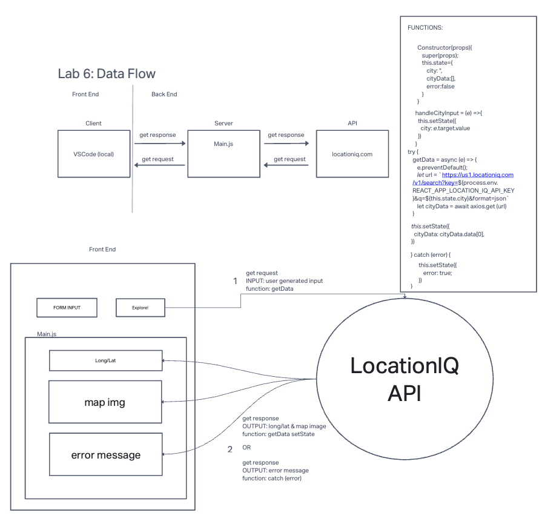

# Project Name: City Explorer

**Author**: Donna Ada  
**Version**: 1.0.0

## Overview

A web application built with React that takes in city as a user input and returns information on that sepecific city.

## Getting Started

1. Clone the Repository
2. Run `npm install` to install all the dependencies required
3. Create an account on LocationIQ and get a personal API Key
4. Create a copy of `.env.sample` and name it `.env`
5. Replace `<YOUR_LOCATIONIQ_API_KEY>` with the API from step 3.

## Architecture

- HTML
- CSS
- React Bootstrap
- Axios

## Change Log
<!-- Use this area to document the iterative changes made to your application as each feature is successfully implemented. Use time stamps. Here's an example:

01-01-2001 4:59pm - Application now has a fully-functional express server, with a GET route for the location resource. -->

## Credit and Collaborations
<!-- Give credit (and a link) to other people or resources that helped you build this application. -->

<!-- ## Time Estimates

Name of feature: ________________________________

Estimate of time needed to complete: _____

Start time: _____

Finish time: _____

Actual time needed to complete: _____  -->

## Web Reqeust Response Cycle (WRRC)

